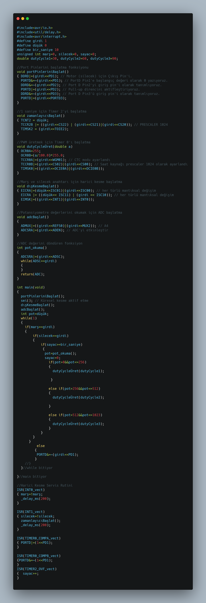

# 🚗 Arduino-Based Automatic Wiper System  

This project is an **Arduino-powered automatic windshield wiper system** designed to detect rain and activate wipers accordingly. 🌧️🚘 It improves driving safety by automatically responding to weather conditions.  

## 📌 Features  
✅ **Rain Detection** – Uses a rain sensor to detect water on the windshield.  
✅ **Automatic Wiper Activation** – Starts and adjusts speed based on rain intensity.  
✅ **Arduino Compatible** – Easy to set up and modify.  
✅ **Energy Efficient** – Runs only when needed.  

## 📁 Project Contents  
📜 **Code Files** → Arduino source code (to be added)  
📄 **Circuit Diagram** → [ArabaSilecek.pdf](ArabaSilecek.pdf) – Detailed wiring schematic  
🔧 **PCB Design** → [ArabaSilecek.brd](ArabaSilecek.brd) – PCB design file  
📷 **Project Image:**  

  

## ⚙️ Components Used  
- **Arduino (UNO/Nano/Pro Mini)**  
- **Rain Sensor Module**  
- **Servo Motor or Wiper Motor**  
- **Relay Module**  
- **Jumper Wires**  
- **Power Supply**  

## 🚀 How to Use?  
1️⃣ **Connect the Arduino to your computer**  
2️⃣ **Upload the provided code via Arduino IDE**  
3️⃣ **Assemble the circuit as per the PDF schematic**  
4️⃣ **Test the system with water droplets**  

## 🛠️ Setup  
📌 **Install Arduino IDE** and required libraries.  
📌 **Connect the sensor and motor, then upload the code.**  
📌 **Run tests and fine-tune sensitivity as needed!**  

## 📷 Visuals  
### 🔹 Circuit Diagram  
📄 **Download the schematic:** [ArabaSilecek.pdf](ArabaSilecek.pdf)  

### 🔹 PCB Design  
🔧 **PCB File:** [ArabaSilecek.brd](ArabaSilecek.brd)  

### 🔹 Prototype Image  
  

## 🤝 Contributing  
Feel free to contribute by submitting a **pull request** or reporting issues!  

💡 **Got feature ideas? Share them with us!**  

---

**GitHub Repository:** **[Arduino-Automatic-Wiper-System](https://github.com/metesahankurt/Arduino-Automatic-Wiper-System)**  
